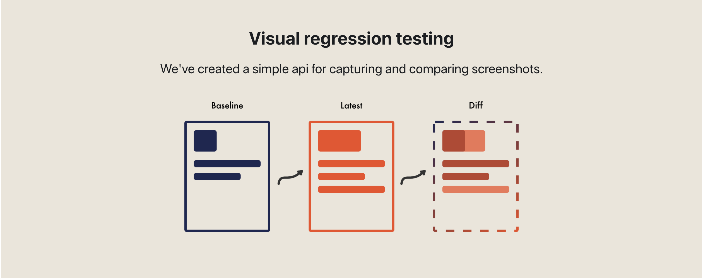

# Visual Testing

What are visual tests?

Visual tests are a mechanism used which are similar to end to end tests. The application is loaded and the test navigats to a particular screen and loads a defined state. The visual state of the screen is then captured as an image. 
On the first run of the test, this image captured will become the baseline image.
On the next run of the test the same screen and state will be loaded and the new image will be compared against the baseline image. 
If there is any difference between the two images the test will fail and the developer will become aware that their changes has affected the visual rendering.

## Current Bottleneck
At present there is a clear bottleneck in the development process of the quo2 component library. 
The main problem here is the need for the UX team to review the pull requests. This process is essential but adds a large expense to time required. 
While there are possible solutions to improve that process there is another factor which comes into play. What happens when a developer has to refactor a component, or add in some code re-use for a component.
This in theory means that the ux team has to review every component in the codebase to make sure they are all still to design spec, or at least the ones that are evidently affected by said changes. This bottleneck will multiply by a huge factor as the component library grows.

## Future bottlenecks
This problem will re-appear for other areas of development of the frontend side of the applications. As we move developer attention from the component library to developing the mobile app screens we are sure to face the same issues. If we get the process right we can smooth out development lifecycle for all future work.

While we might avoid less work for the UX and QA team by doing this, evidently there is more work for the developers to do as they will be the ones writing these tests.

## What can we do to improve this?
Adding visual tests to the quo2 component library will help guarantee that 
most renderings of each component are still to spec as per the design team.

Using these tests in our CI/CD pipeline means then the developers can merge their code with more confidence they are not breaking any of the UI that's already in place.

Further, given the simple nature of visual tests there is potential to automate the generation of our visual tests. This will be discussed shortly.

### What tools are there to use
For this I researched a few different tools that work with React-Native.

#### Detox 
https://wix.github.io/Detox/

This tool is well established and even recommended by React Native as the best option for e2e testing. To use Detox for visual testing takes some small tweaks which I achieved by following this blog.
https://hughmccamphill.com/visual-regression-testing-react-native-apps-with-detox-and-jest

#### React Native Owl 
https://formidable.com/open-source/react-native-owl/

This is a very lightweight and relatively new solution. 
Overall it seems really good from the videos and docs I saw however I did run into issues getting this to build. 

From some research it seems possible to use React Native Owl and Detox together. 
It's worth watching this video to get some insight into the tool
https://www.youtube.com/watch?v=cSNOd0RTprI&t=4417s

#### Jest Image Snapshots
https://github.com/storybookjs/storybook/tree/main/addons/storyshots/storyshots-puppeteer#imagesnapshots
This is what's used in the Detox implementation but it's possible to have another tool to use as a selector and implement the testing with Jest Image Snapshots.

#### Appium
https://appium.io/

https://www.velotio.com/engineering-blog/test-automation-in-react-native-apps-using-appium-and-webdriverio

#### Selenium

#### BackstopJS
This toolset is mostly for web based applications however we can use their diffing app 
to improve how we compare the images. It has a nice UI and some good tools to help visualize where the changes are, particularly when the changes are subtle.
https://github.com/garris/BackstopJS/tree/master/compare

#### Other options
These tools require using a browser so unless we are considering some implementation of using the component library in reaft-native-web
NB - I haven't fully researched it's possible to use the following tools, just some options I encountered that seemed interesting.

##### Loki
https://loki.js.org/getting-started.html

##### Chromatic 
https://www.chromatic.com/
Chromatic is a highly developed tool and is recommend by the creators of Storybook. However it requires in browser use, and has a pricing model beyond a certain size. 
Aside from that it has a nice UI which can be integrated into the CI/CD process to help the dev/designer communicate about the UI.

##### Applitools
https://applitools.com/
I didn't look into Applitools considering the model is a bit different and there is pricing involved. However it is another possible solution to this issue that can be considered.

### Automatic Test Generation
We can bring this tooling one step further by using static tooling in the codebase to automatically generate these visual test when a developer adds or updates a new component. 

This comes at some tradeoff as to get this data we have to standardise some things, like how we get the data from the quo2 components.

#### getting the data
To get the data for the visual tests I had to parse the screens files in the quo2 component library. From this the test suite can navigate to those pages and then use the data to know which component to select and then what prop value to set for each permutation.

In my branch - https://github.com/status-im/status-mobile/tree/jcaprani/visual-test
it's possible to see how I have achieved one implementation of this.

There are two methods used here for demonstration purpose.
1 - using the linting tool clj-kondo analysis - https://cljdoc.org/d/clj-kondo/clj-kondo/2022.06.22/doc/analysis-data
See: https://github.com/status-im/status-mobile/blob/jcaprani/visual-test/Makefile#L293

*This data is quite limited*, so it doesn't seem like the best choice. However there does seem to be ways to extend this tool which are available in the docs so perhaps it's possible to use clj-kondo.

2 - using edn files which get imported into our cljs files and also for a node (or any suitable tool) to write a script to build up the test data -
To achieve this I used the package edn-data https://www.npmjs.com/package/edn-data
https://github.com/status-im/status-mobile/blob/jcaprani/visual-test/create-test.js

The implementation of how the data in the tests is then done here.
https://github.com/status-im/status-mobile/blob/jcaprani/visual-test/e2e/app-visual-tests.e2e.ts#L58

#### Increasing coverage
This can easily be then extended to both ios and android, and also both light and dark mode.
Further we can increase the number of devices. 
Localization can also be added to cover multiple languages and locales.

While it is easy to add these options in, we have to consider of how time expensive these tests will be.
One option is to have a base set of tests on the standard developer branch/pull-request and then have 

#### Things to consider
Some issues I encountered while creating a POC.

##### Avoiding noise
Given how easily this test set can grow there is the issue of avoiding bringing too much noise into the codebase. 
Some thought and future proofing should be brought forward for this. 
One example where this is an issue is the button component where in it's current state there are 768 permutations of the prop settings. Most of these configurations are invalid and are not necessary.

Perhaps some configuration in the codebase to switch off automatic test generation for components like this and we can manually create them.

##### reducing the number of images 
Another idea that could be beneficial is to render multiple permutations on one screen.
This means that no data is lost in the visual tests  but the number of comparison images is reduced making it easier for developers and reviewers to reason with.

Some ideas and tools which might help with that are:

https://github.com/bhauman/devcards
https://github.com/cjohansen/dumdom-devcards

##### test input not right
might need to add another descriptor/previewer tool for components that inspect numbers as input. 
This means the test data can be accurately input. Currently adding a string to some number components renders NaN and it does not seem right.

## Proposed Developer Lifecycle for new component ( and on going maintenance )
Developer discusses with design team about component
Implements component to spec
Dev commits work and gets approval from design team.
Once design team is happy the developer can then add the visual test for that component and it's various prop permutations into the codebase.
The visual test images are now marked as *to spec* by the design team.

## Steps forward
- Decide on technologies to use
- Decide on test creation approach - manual, automatic or hybrid test creation
-/-m- create some issues to add tests for missing stories & add to issue template for new components
-/-a- create a story to set up codebase. Decide what tools and how we want to approach this
-/-h- both

- Implement base coverage from existing components
- Integrate into CI/CD 
- consider how to maintain CI/CD effectiveness while adding a lot of tests.

## Resources
https://dev.to/jenc/storybook-and-chromatic-for-visual-regression-testing-37lg

https://applitools.com/automated-visual-testing-best-practices-guide/#localization-testing

## How to get this branch working:

Build the app:

make run-clojure
make run-metro
detox build --configuration ios.sim.debug

to run tests: 
detox build --configuration ios.sim.debug

To add more automatic tests:
Update create-test.js (line 16) and add in the other file names.

Alternatively add other features in `./src/quo2/screens/${filename}-options.edn`

Then run `make generate-visual-test`

visual Tests configs are stored in `e2e/visual-tests`
and then the rests are run in the file `e2e/app-visual-tests.e2e.ts`

